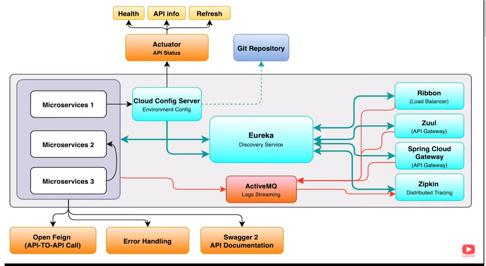
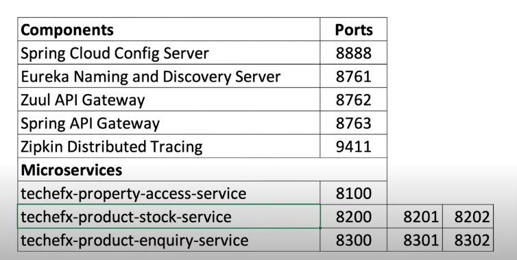

# microservices-springboot-1

[](https://github.com/tokishorbankar/microservices-springboot-1)

```
Microservices with Spring Boot & Live Example

```


## Microservices Architecture




## Microservices Running Port info




## Source code on GitHub

| Microservices Name             | Port |
| -------------------------------|------|
| [environment-variable-repo](https://github.com/tokishorbankar/environment-variable-repo.git)  | GitHub |
| [cloud-config-server-service](https://github.com/tokishorbankar/cloud-config-server-service.git)  | 8888 |
| [techefx-property-access-service](https://github.com/tokishorbankar/techefx-property-access-service.git)  | 8100 |